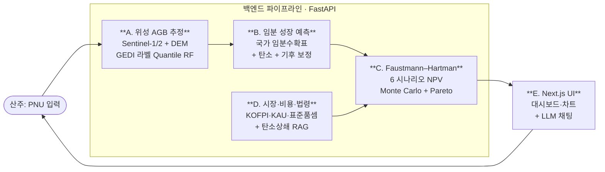

# 다목적 산림경영 AI Agent

> 위성 영상과 임분과학, 탄소시장 데이터를 하나로 엮어 산주의 단 하나의 질문에 답한다 —
> *"지금 이 숲을 어떻게 하는 것이 가장 이로운가."* 충북 보은 사유림 파일럿.

**🔗 라이브 데모 → https://mofom-ai.vercel.app** ｜ **📦 저장소 → https://github.com/jwn6174-crypto/forest-ai-agent**

---

## 🎯 프로젝트 개요

한국의 사유림 산주는 평생에 몇 번, 자기 산의 가치를 가르는 무거운 결정 앞에 선다. 지금 벌채해 목재로 팔 것인가, 몇 년 더 키워 등급을 올릴 것인가, 베지 않고 탄소배출권으로 수익을 낼 것인가, 아니면 솎아베기 보조사업을 받으며 잔존목을 키울 것인가. 결정 하나가 수천만 원에서 수십억 원을 좌우하지만, 정작 산주가 손에 쥔 근거는 빈약하다. 이 프로젝트는 그 빈자리를 메우기 위해 시작되었다.

산주가 임야의 필지번호(PNU)를 입력하면, 시스템은 위성으로 추정한 임분 상태에서 출발해 임분 성장 곡선과 탄소·목재 시장가격을 거쳐, 1849년 Faustmann의 임지기대가치와 1976년 Hartman의 비목재 가치 이론을 한국 실데이터로 풀어낸다. 그 결과로 여섯 가지 경영 시나리오의 순현재가치(NPV)와 그 불확실성, 나아가 산주가 내일 당장 어디에 전화해 무엇을 신청해야 하는지까지를 한 화면에 제시한다.

다섯 모듈 — 위성, 성장, 경제성, 시장, 인터페이스 — 이 위성 영상에서 산주의 화면까지 하나의 파이프라인으로 이어져 있다. 필지번호 하나를 받아 6개 시나리오와 추천을 약 0.4초에 돌려주며, 234개의 단위 테스트가 이 흐름의 정확성을 보증한다. 파일럿 지역은 충북 보은이고, 주력 수종은 강원지방소나무다.

---

## 🧭 어떻게 동작하는가



산주가 "분석 시작"을 누른 순간, 요청은 다섯 단계를 차례로 통과한다. 먼저 **모듈 A**가 Sentinel-1·2 위성 영상과 수치표고모형에서 임분의 입목축적과 탄소량을 추정한다. GEDI 라이다 관측을 라벨로 삼은 Quantile Random Forest가 단일 추정값이 아니라 5–95% 예측구간을 함께 내놓아, 위성 추정에 늘 따르는 불확실성을 처음부터 수치로 드러낸다. 그 결과를 **모듈 B**가 받아 국가 임분수확표를 기준으로 30년 성장 궤적을 그리고, 탄소흡수량과 등급분포, 기후 시나리오 보정을 차례로 얹는다. 한편 **모듈 D**는 같은 시점의 등급별 원목가격과 탄소배출권 시세, 작업 비용을 실시간·실데이터로 가져온다. 이 모든 입력이 **모듈 C**로 모이면, 여섯 가지 경영 시나리오 각각에 대해 Faustmann–Hartman NPV를 Monte Carlo로 수백 번 시뮬레이션하고, 위험과 수익의 균형에 따라 하나를 추천한다. 마지막으로 **모듈 E**가 이 결과를 차트와 표로 그려 내고, 산주가 일상 언어로 던지는 질문에 LLM이 답한다.

서버는 부팅할 때 약 10초 동안 무거운 1회성 비용 — 탄소 시세 조회, 임분수확표 적재, 전체 파이프라인 워밍 — 을 미리 치러 둔다. 그 덕분에 첫 사용자 요청부터 약 0.4초로 응답한다. 모듈 사이는 두 개의 얇은 어댑터로만 연결되어, 가벼운 NPV 계산이 무거운 위성 모델의 무게를 떠안지 않고, 한 모듈이 실패해도 나머지 결과는 보존된다.

시스템이 견주는 여섯 갈래의 길은 이렇다. 지금 벌채하기, 5년 또는 10년 더 키워 등급을 올린 뒤 벌채하기, 베지 않고 산림탄소상쇄(KOC)로 수익을 내며 벌기령을 연장하기, 표고·송이 같은 임산물을 곁들이기, 그리고 솎아베기 보조사업을 받으며 잔존목을 10년 더 키우기. 각 시나리오는 산림자원법 시행규칙 별표3의 법정 기준벌기령을 충족하는지 자동으로 판정하므로, 예컨대 30년생 강원지방소나무에게는 "즉시 벌채"라는 선택지가 처음부터 닫혀 있다.

| 모듈 | 담당 | 역할 |
|---|---|---|
| **A** | 김민석 | 위성 AGB 추정 (Quantile Random Forest · GEDI 라이다 라벨) |
| **B** | 나정우 | 임분 성장 예측 · 탄소 · 등급분포 · 기후 보정 |
| **C** | 최희도 | Faustmann–Hartman 경제성 분석 · 통합 어댑터 |
| **D** | 나정우 | 원목 시장가격 · 법령 · 비용 · RAG |
| **E** | 하수범 | Next.js 대시보드 · LLM 채팅 |

---

## 🔬 핵심 역량과 학술적 기여

성장 예측은 단순한 표 조회를 넘어선다. 국가 임분수확표를 골격으로 삼되, 국립산림과학원의 탄소흡수량 표준과 국가산림자원조사(NFI) 충북 46,722 그루로 적합한 Weibull 등급분포를 결합해, 강원지방소나무가 30년에서 60년으로 자라는 동안 대경재 본수가 64본에서 120본으로 늘어나는 과정을 추적한다. 이 등급 변화야말로 "언제 베는 것이 가장 이로운가"라는 질문에 직접 답하는 근거가 된다.

여기에 기후변화를 더한다. NFI 5·6·7차 시계열과 지위지수를 회귀해 학습한 기후 보정 모델(R² 0.228)이 NASA NEX-GDDP-CMIP6의 SSP 시나리오를 받아 미래 생장을 조정한다. 주목할 점은 이 모델이 자신의 한계를 정직하게 드러낸다는 데 있다. 미래 기온이 학습 범위를 벗어나면 트리 모델은 외삽 구간에서 신뢰를 잃는데, 시스템은 이를 감추지 않고 "SSP 시나리오 간 구분이 제한적"이라는 경고를 자동으로 표시한다. 추정을 확신으로 포장하지 않는 것이 산주에게 더 이로운 정보라는 설계 원칙이다.

경제성 분석의 심장은 Faustmann–Hartman 모델이다. 원목 수입과 탄소 수입, 임산물 수입, 보조금에서 작업 비용과 수확 목재제품(HWP)의 탄소 감쇠 손실을 제하고 할인해, 각 시나리오의 순현재가치와 임지기대가치를 구한다. 가격·생장·할인율·기후를 포함한 여섯 가지 불확실성을 Latin Hypercube Monte Carlo로 동시에 흔들어, 단일한 숫자가 아니라 분포로 답한다. 그 분포는 다시 산주에게는 "약 5,400만 원, 최악의 경우 4,500만 원"이라는 한 줄로, 정책담당관에게는 전체 구간과 파레토 프론티어로 번역된다.

이 통합 과정에서 다섯 건의 학술적 발견이 정리되었고, 그중 셋은 하나의 가설로 수렴한다 — 한국 산림의 탄소·바이오매스 추정에는 방법마다 체계적 편향이 있으며, 그 방향이 서로 반대라는 것이다. 산림탄소상쇄 인증실적은 자연 성장 모델보다 45% 높고(인증 = 과대), 국가 수확표의 등급분포는 NFI 실측보다 상위 등급을 123% 과대평가하며(수확표 = 과대), 위성 GEDI는 고밀도 침엽수림을 과소추정한다(위성 = 과소, 외부검증 R² = −0.187). 세 편향의 방향이 반대이므로, 보은 산외면 오대리의 실제 인증사업(25.6 ha, 8,197 tCO₂)에서 인증을 상한으로, 자연 성장 모델을 하한으로, 위성을 독립된 제3의 측정으로 배치하면, 그 차이의 원인이 인증의 회계 가정인지 실제 경영 효과인지를 삼중으로 교차검증할 수 있다.

다섯 번째 발견은 시점에 관한 것이다. 배출권(KAU) 가격은 16개월 동안 79% 올라 15,550원에 이르렀고, 산주가 탄소를 실제로 팔기 시작하는 의향가격(WTA 17,039원)에 8.7% 차이로 다가섰다. 아직 그 문턱을 넘지는 않았으며 — 시스템의 NPV 계산에도 이 '미돌파'가 그대로 반영되어 탄소 수익이 0으로 잡힌다 — 그러나 돌파가 임박했다는 사실은, 지금이 산주가 탄소시장 진입을 준비할 결정적 시점이라는 이 프로젝트의 정책적 메시지를 떠받친다.

---

## 📊 데이터 기반

이 모든 추정은 실데이터 위에 선다. 16,000행이 넘는 국가 임분수확표, KOFPI의 분기별 등급별 원목가격, data.go.kr에서 실시간으로 받아오는 KAU 배출권 시세, 산림사업 표준품셈과 시중노임으로 짠 작업 비용, 그리고 NFI 5·6·7차의 충북 표본점 3,131곳·137,436 그루가 그 골격을 이룬다. 기후 축으로는 보은의 6개 산악기상 관측소와 인근 5개 시군의 30년 평년값, 그리고 NASA NEX-GDDP-CMIP6의 SSP 시나리오를 끌어왔다. 산림탄소상쇄 제도의 11개 방법론 문서는 281개 청크로 색인되어, 어떤 사업유형에 해당하는지를 근거와 함께 짚어 준다.

---

## ⚡ 빠른 시작

전체 Monte Carlo 엔진은 로컬 Python 서버로 구동한다(라이브 데모는 대표 임지 사례로 화면 흐름을 체험하도록 구성했다). 백엔드와 프런트엔드 두 프로세스를 함께 띄운다.

```bash
# 1. 의존성 설치
pip install -r requirements.txt

# 2. 곧바로 검증 — 경제 엔진 실행 + 전체 테스트(234개)
python -m module_c.src.compute_lev
pytest module_c/tests/ module_bd/tests/ shared/

# 3. 서버 기동 (백엔드 8001 + 프런트 3000)
python api_server.py            # 부팅 약 10초 워밍 후 요청당 ~0.4초
cd ui && npm install && npm run dev
```

`.env`에는 `DATA_GO_KR_KEY`(KAU 시세), `LAW_OC`(법령), `VWORLD_KEY`(PNU 조회)를 설정한다. 위성 모듈을 실데이터로 돌리려면 보은 래스터(GEE export)가 추가로 필요하며, 없으면 자동으로 지역 프로파일 모의값으로 폴백한다.

---

## 👥 팀

국민대학교 산림환경시스템학과의 네 학부생이 한 모듈씩 맡았다. **김민석**은 위성에서 임분 상태를 읽어내는 모듈 A를, **나정우**는 임분 성장과 시장·법령·비용을 다루는 모듈 B·D를, **최희도**는 경제성 분석과 모듈 간 통합을 책임지는 모듈 C를, **하수범**은 분석 결과를 산주에게 전하는 모듈 E를 구현했다. 이 작업은 한국연구재단(NRF) 일반공동연구의 일부이며, CLIM Lab(임철희 교수)의 지원을 받았다.

---

## 📚 학술 기반

- **Faustmann (1849)** — 임지기대가치(Land Expectation Value)
- **Hartman (1976)** — 산림의 비목재(탄소) 가치
- **IPCC 2019 Refinement** Vol.4 Ch.12 — 수확 목재제품(HWP) 탄소 감쇠
- **산림자원의 조성 및 관리에 관한 법률 시행규칙** (별표 3, 2023 개정) — 법정 기준벌기령
- **박 (2020)** — 산주 WTA 의지가격(17,039원/tCO₂)
- **KOFPI** 분기별 원목시장가격조사 · **산림사업 표준품셈**(고시 제2025-82호)
- **국립산림과학원** 탄소흡수량(2003 개발, 2013/2024 개정) · 산악기상정보(보은 6 관측소)
- **국가산림자원조사 NFI 5/6/7차** (산림빅데이터팀, 2006–2020)
- **기상청 ASOS** 일자료(data.go.kr, 5 시군 30년 평년) · **NASA NEX-GDDP-CMIP6** (SSP2-4.5/5-8.5)
- **산림탄소상쇄제도** 운영지침 + 8 사업유형 방법론(2025.1.2.)
- **Burton et al. (2024)** ISIMIP3a/ATTRICI Factual/Counterfactual 프레임워크 (방법론 참고)

---

## 🔗 링크

- **라이브 데모** — https://mofom-ai.vercel.app
- **GitHub** — https://github.com/jwn6174-crypto/forest-ai-agent
- **모듈 C 인용 정보** — [module_c/CITATION.cff](module_c/CITATION.cff)
- **문의** — 최희도 (zxsa0716@kookmin.ac.kr) · 모듈 B/D 나정우 (jwn6174@gmail.com)
